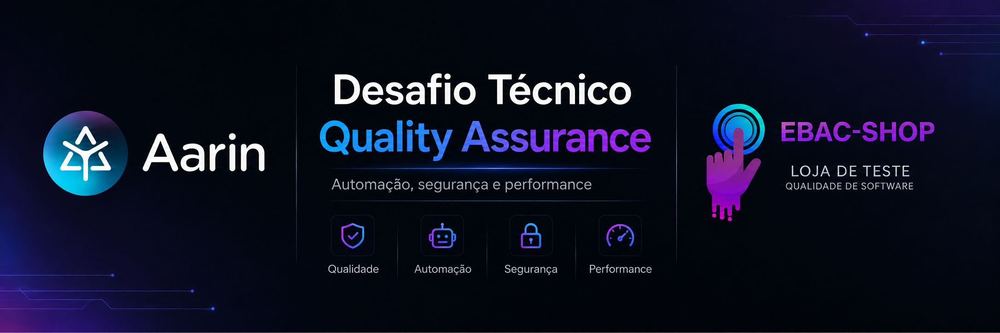

# EBAC Shop — Desafio Técnico de QA

<p align="center">
  
</p>

Este projeto foi desenvolvido a partir da jornada de compra da EBAC Shop, com foco não apenas em automatizar o fluxo solicitado, mas também em entender os principais riscos envolvidos na experiência de compra.

Antes de iniciar a automação, percorri a aplicação manualmente algumas vezes. Essa exploração foi importante para entender o comportamento real da plataforma, observar particularidades do ambiente e decidir quais cenários realmente agregariam cobertura.

A partir disso, priorizei os testes considerando risco, impacto para o usuário e relevância para o fluxo de negócio.

---

## Estratégia de qualidade

A estratégia começou com testes exploratórios manuais, com o objetivo inicial de entender o fluxo completo:

- navegação pela loja;
- seleção de produto;
- escolha de variações;
- carrinho;
- alteração de quantidade;
- checkout;
- criação do pedido;
- consulta posterior em **Meus Pedidos**.

Durante essa exploração foram observados alguns comportamentos que influenciaram diretamente a automação, como elementos responsivos duplicados no DOM, particularidades na seleção de tamanho e cor, dependência de sessão e comportamento assíncrono durante o checkout.

Somente depois desse mapeamento foi definida a cobertura automatizada.

A intenção não foi criar o maior número possível de testes, mas cobrir os pontos que apresentavam maior risco dentro da jornada proposta.

---

## Cenários automatizados

### Login

Valida a autenticação de um cliente cadastrado e confirma que a sessão foi estabelecida corretamente.

Arquivo:

```text
tests/auth/login.spec.ts
```

### Fluxo de compra E2E

Cobre a jornada principal solicitada no desafio:

1. autenticação do cliente;
2. acesso à loja;
3. seleção de um produto;
4. escolha das variações de tamanho e cor;
5. adição ao carrinho;
6. validação inicial de preço e quantidade;
7. alteração da quantidade;
8. validação do recálculo;
9. avanço para checkout;
10. preenchimento dos dados;
11. escolha do método de pagamento;
12. finalização do pedido;
13. confirmação da compra;
14. validação do pedido em **Meus Pedidos**;
15. abertura e conferência dos detalhes persistidos.

Arquivo:

```text
tests/checkout/purchase-flow.spec.ts
```

### Integração do checkout com o backend

Além da validação visual, o fluxo E2E acompanha a requisição responsável pelo processamento do checkout.

Foi identificada durante a exploração a chamada:

```text
POST /?wc-ajax=checkout
```

A automação valida que essa integração retorna HTTP `200` e, em seguida, confirma que o pedido foi criado e permaneceu disponível na área do cliente.

Essa cobertura foi adicionada para reduzir o risco de um falso sucesso visual, no qual a interface poderia indicar que a compra terminou enquanto o pedido não foi efetivamente persistido.

### Segurança — controle de acesso ao pedido

Foi criado um cenário adicional para verificar o comportamento de um pedido após o encerramento da sessão.

O teste:

1. autentica um cliente;
2. consulta um pedido existente;
3. encerra a sessão;
4. tenta acessar diretamente a URL daquele pedido;
5. verifica que os detalhes da compra, itens e dados do cliente não ficam disponíveis sem autenticação.

Arquivo:

```text
tests/security/order-access.spec.ts
```

### Performance exploratória do checkout

Também foi medido o intervalo entre a confirmação da compra e a conclusão do processamento do pedido.

Arquivo:

```text
tests/performance/checkout-performance.spec.ts
```

Foi utilizada uma referência exploratória de **5 segundos**.

Esse número **não representa um SLA fornecido pelo negócio**. Ele foi adotado somente como referência para observar o comportamento do checkout.

As execuções realizadas apresentaram tempos próximos entre si:

```text
8.137 ms
8.525 ms
8.289 ms
8.272 ms
```

O comportamento ficou, portanto, em torno de **8,3 segundos**.

Isso não foi classificado como defeito.

Sem uma regra de negócio, documentação ou SLA que determine qual é o tempo máximo aceitável para concluir uma compra, o resultado deve ser tratado como um **ponto a ser validado com Produto e Engenharia**.

Por esse motivo, a referência de 5 segundos não funciona como quality gate bloqueante no CI. Caso o tempo fique acima dela, o teste registra a informação como warning.

### Smoke test com K6

Foi realizado também um teste leve de carga com K6 em duas etapas importantes anteriores ao checkout:

- página de produto;
- carrinho.

Configuração utilizada:

```text
2 usuários virtuais
10 segundos
```

Thresholds utilizados:

```text
taxa de erro < 1%
p95 < 2 segundos
```

Resultado observado:

```text
20 requisições
20 checks aprovados
0% de falhas
p95: 929,53 ms
média: 512,44 ms
```

O resultado indica comportamento estável sob carga leve nos pontos avaliados.

Esse cenário deve ser entendido como **smoke test de performance**, e não como teste de capacidade, stress ou volume.

Arquivo:

```text
tests/k6/smoke-test.js
```

---

## Cenários considerados mais críticos

### Finalização do checkout

É o ponto em que a intenção de compra se transforma efetivamente em um pedido.

Uma falha nessa etapa pode gerar perda da venda, inconsistência de dados, duplicidade ou uma percepção incorreta de sucesso para o cliente. Por esse motivo, o checkout recebeu cobertura funcional, de integração e de performance.

### Alteração da quantidade e recálculo

Quantidade e valor estão diretamente ligados à cobrança.

Uma inconsistência entre quantidade, subtotal e total pode gerar impacto financeiro tanto para o cliente quanto para a empresa.

### Persistência do pedido

Não considerei suficiente validar apenas a mensagem de **Pedido recebido**.

O fluxo também verifica se o pedido permanece disponível posteriormente em **Meus Pedidos** e se os seus detalhes podem ser consultados.

### Controle de acesso

Pedidos carregam informações de compra e dados pessoais.

Por isso, foi incluído um cenário específico para verificar que essas informações não continuam acessíveis após o logout.

---

## O que decidi não automatizar

Nem todo cenário possível foi transformado em automação.

Algumas decisões foram intencionais.

### Compra com dois produtos diferentes

Não foi criado um cenário com dois produtos diferentes porque, dentro do objetivo deste desafio, isso não adicionaria uma nova regra relevante ao fluxo principal.

O comportamento crítico de carrinho já é exercitado com:

- inclusão de produto;
- variação;
- quantidade;
- subtotal;
- total;
- checkout.

Adicionar outro produto aumentaria o tempo e a complexidade da execução sem reduzir de forma significativa a incerteza sobre o fluxo obrigatório.

Em um produto real, esse cenário poderia ser incluído caso existissem regras específicas envolvendo promoções, frete, estoque ou combinação de itens. Num caso real esse teste pode ser incluso.

### Muitas combinações de tamanho e cor

Foi utilizada uma combinação válida representativa.

Não foi criada uma matriz completa de tamanhos e cores porque não foram identificadas regras diferentes entre essas combinações.

Caso preço, disponibilidade ou comportamento variassem de acordo com tamanho/cor, essa cobertura poderia ser parametrizada.

### Todos os meios de pagamento

Os métodos disponíveis foram explorados durante os testes manuais.

Para o fluxo automatizado principal foi priorizado **Pagamento na entrega**, por permitir finalizar a jornada de maneira previsível no ambiente.

Os demais métodos continuam sendo candidatos naturais para regressão caso existam regras específicas de negócio ou integrações diferentes.

### Carga agressiva no checkout

Não foi executado teste de carga pesada sobre a finalização da compra, porque cada conclusão gera um pedido real.

Executar dezenas ou centenas de compras artificialmente poderia poluir os dados e até prejudicar a utilização do ambiente.

Por isso, a carga foi aplicada de maneira leve e não destrutiva em produto e carrinho.

### Concorrência e duplicidade de pedidos

Foi considerado um cenário envolvendo finalizações simultâneas da mesma compra.

Ele poderia ser interessante para investigar idempotência e possibilidade de pedidos duplicados.

Não foi executado porque criaria efeitos colaterais reais no ambiente compartilhado, mas em um ambiente controlado, considero esse um cenário relevante.

---

## Achados e pontos de atenção

### Checkout com tempo próximo de 8 segundos

As execuções apresentaram comportamento consistente próximo de 8,3 segundos.

Como não foi disponibilizado SLA para essa operação, não considero correto classificar o comportamento como bug somente porque ultrapassou a referência exploratória de 5 segundos.

Sugestões:

- confirmar com Produto qual experiência é esperada;
- verificar se existe SLA ou requisito não funcional documentado;
- observar métricas do processamento;
- caso necessário, investigar em qual etapa está concentrado o tempo.

### Diferença entre navegação e processamento transacional

O K6 apresentou p95 inferior a 1 segundo em produto e carrinho sob carga leve, enquanto a conclusão do checkout ficou próxima de 8 segundos.

Isso sugere que a navegação básica apresenta comportamento diferente da etapa transacional.

Não é possível concluir a causa apenas com esses testes, mas o checkout seria o primeiro ponto que eu aprofundaria em uma investigação de performance.

### Aplicação utilizando HTTP

Durante a exploração pelo Network foi observado que o ambiente utiliza:

```text
http://
```

e que informações do checkout trafegam na requisição da transação.

Em um ambiente real, dados pessoais e credenciais devem estar protegidos durante o transporte por HTTPS/TLS.

Como este é um ambiente fornecido especificamente para testes, registro esse ponto como **risco potencial**, e não como vulnerabilidade de produção confirmada.

### Elementos duplicados no DOM

Durante a automação foram encontrados elementos equivalentes das versões responsivas do layout coexistindo no DOM.

Alguns estavam visíveis e outros ocultos.

Isso exigiu seletores mais específicos para evitar que a automação interagisse com componentes que não representavam a interface apresentada ao usuário.

Como melhoria, seria interessante revisar a semântica desses componentes e garantir diferenciação adequada dos elementos inativos.

### Estado das variações de produto

Os componentes visuais de tamanho e cor não refletiram de maneira confiável o estado selecionado por atributos como `aria-checked` ou por classes CSS.

A automação passou a validar o valor efetivamente utilizado pelo formulário.

Além do impacto na testabilidade, considero válido avaliar esse comportamento também sob a ótica de acessibilidade.

### Compra sem autenticação

Durante os testes exploratórios foi observado que a plataforma também permite concluir uma compra sem um usuário autenticado.

Esse comportamento não representa necessariamente um problema: muitas plataformas permitem checkout como convidado.

Entretanto, como existe uma área autenticada chamada **Meus Pedidos**, considero importante que esteja clara a regra de associação entre:

```text
pedido de convidado
      ↓
conta do cliente
      ↓
histórico de pedidos
```

Caso um cliente finalize uma compra como convidado e posteriormente acesse uma conta, é importante que Produto defina claramente se aquele pedido deve ou não aparecer no histórico.

---

## Cenário de investigação

### “Às vezes, o cliente paga, mas o pedido não aparece em Meus Pedidos.”

Como não haveria acesso ao código-fonte, eu começaria buscando contexto. Verificaria se existe documentação funcional ou técnica daquele fluxo, histórico de incidentes semelhantes, bugs já reportados e possíveis correções anteriores.

Então eu reproduziria uma compra ponta a ponta acompanhando a execução pelo Network e registraria, para a mesma tentativa:

- usuário;
- horário aproximado;
- método de pagamento;
- resposta da requisição de checkout;
- número ou identificador retornado para o pedido;
- comportamento apresentado pela interface.

Durante a exploração deste desafio validei tanto o comportamento de um usuário autenticado quanto o de um usuário deslogado.

No fluxo autenticado, o pedido criado permaneceu disponível posteriormente em **Meus Pedidos**.

Também observei que a aplicação permite realizar compras sem autenticação. Nesse caso, naturalmente não existe uma área autenticada de pedidos disponível imediatamente para aquele usuário.

Isso adicionaria uma pergunta importante à investigação:

**O cliente estava autenticado no momento em que concluiu a compra?**

Mesmo que ele posteriormente entre em sua conta e diga que o pedido não está em **Meus Pedidos**, seria necessário confirmar se aquela compra foi realizada dentro da mesma sessão autenticada ou como convidado.

Depois dessa primeira análise, eu levaria as evidências para Produto e Backend.

Minha próxima pergunta seria:

**O pedido chegou a ser persistido?**

A partir daí, a investigação ficaria mais direcionada.

#### O checkout retornou sucesso, mas não existe pedido no backend

O foco passa a ser criação ou persistência do pedido.

Eu investigaria logs do mesmo intervalo, erros de banco, timeout ou falhas de integração.

#### O pedido existe no backend, mas não aparece em Meus Pedidos

O problema provavelmente está depois da persistência.

Eu investigaria:

- consulta utilizada pelo histórico;
- associação do pedido com o usuário;
- sessão;
- cache;
- sincronização;
- regras de exibição;
- eventual processamento assíncrono.

#### O pedido foi criado como convidado

Eu confirmaria com Produto qual é a regra esperada para associação posterior entre pedidos de convidados e contas cadastradas.

#### O pedido aparece depois de algum tempo

Isso aumentaria a hipótese de processamento assíncrono ou consistência eventual.

#### O comportamento varia conforme o meio de pagamento

Eu passaria a separar a investigação por integração.

Minha hipótese inicial seria, portanto, uma inconsistência em algum ponto entre:

```text
conclusão do checkout
        ↓
persistência
        ↓
associação com o cliente
        ↓
consulta em Meus Pedidos
```

A forma mais rápida de reduzir a incerteza seria acompanhar a mesma transação desde a requisição do checkout até a verificação de sua existência no backend.

Em vez de investigar todas as possibilidades ao mesmo tempo, eu tentaria primeiro descobrir **em qual etapa o estado deixa de ser consistente**.

---

## Sugestões de melhoria

A partir da exploração e dos testes realizados, alguns pontos poderiam ajudar a evoluir a qualidade do produto:

- definir um SLA ou referência oficial para o tempo de processamento do checkout;
- disponibilizar métricas de latência e erro do checkout;
- melhorar a rastreabilidade entre a requisição de compra e o pedido persistido;
- utilizar identificadores de correlação entre frontend e backend;
- documentar claramente a regra de pedidos realizados como convidado;
- revisar atributos de acessibilidade dos componentes de variação;
- utilizar HTTPS/TLS em ambientes que manipulem dados reais;
- disponibilizar ambiente ou massa própria para testes de carga;
- criar mecanismo de limpeza de pedidos gerados por automação.

---

## Stack utilizada

- Playwright
- TypeScript
- Node.js
- K6
- Allure
- GitHub Actions
- dotenv

---

## Estrutura do projeto

```text
.
├── .github/
│   └── workflows/
│       └── playwright.yml
│
├── data/
│   ├── customers.ts
│   └── products.ts
│
├── pages/
│   ├── cart.page.ts
│   ├── checkout.page.ts
│   ├── home.page.ts
│   ├── login.page.ts
│   ├── order.page.ts
│   ├── orders.page.ts
│   └── product.page.ts
│
├── tests/
│   ├── auth/
│   │   └── login.spec.ts
│   ├── checkout/
│   │   └── purchase-flow.spec.ts
│   ├── security/
│   │   └── order-access.spec.ts
│   ├── performance/
│   │   └── checkout-performance.spec.ts
│   └── k6/
│       └── smoke-test.js
│
├── .env.example
├── playwright.config.ts
├── package.json
└── tsconfig.json
```

---

## Configuração do ambiente

Clone o repositório:

```bash
git clone https://github.com/RoxaneNayara/ebac-shop-qa-challenge.git
```

Entre no projeto:

```bash
cd ebac-shop-qa-challenge
```

Instale as dependências:

```bash
npm ci
```

Instale o navegador utilizado pelo Playwright:

```bash
npx playwright install chromium
```

Crie o arquivo `.env` a partir do modelo:

```bash
cp .env.example .env
```

Preencha as variáveis necessárias para o usuário utilizado nos testes.

O arquivo `.env` não é versionado.

---

## Executando os testes

### Suíte Playwright

```bash
npm test
```

### Execução com navegador visível

```bash
npm run test:headed
```

### Modo UI

```bash
npm run test:ui
```

### Apenas testes funcionais e de segurança

```bash
npx playwright test --project=chromium --grep-invert @performance
```

### Performance do checkout

```bash
npx playwright test tests/performance/checkout-performance.spec.ts --project=chromium
```

### Smoke test K6

É necessário ter o K6 instalado.

No macOS:

```bash
brew install k6
```

Execução:

```bash
k6 run tests/k6/smoke-test.js
```

---

## Validações de qualidade do código

Formatação:

```bash
npx prettier --check .
```

Type check:

```bash
npx tsc --noEmit
```

Listagem dos testes:

```bash
npx playwright test --list
```

---

## CI/CD

O projeto utiliza GitHub Actions.

Em `push` e `pull_request` para a branch `main`, são executados:

- instalação das dependências;
- validação do Prettier;
- validação do TypeScript;
- testes funcionais;
- fluxo E2E;
- teste de segurança;
- geração do relatório do Playwright.

O teste de performance do checkout fica separado da execução automática porque cria um pedido real.

Ele pode ser executado manualmente pelo workflow quando houver necessidade de avaliação. Essa decisão evita gerar massa de pedidos desnecessária em cada commit.

---

## Evidências

A execução gera relatório HTML do Playwright e artefatos no GitHub Actions.

Também foram utilizados durante a análise:

- logs do Playwright;
- inspeção de requisições pelo Network;
- relatório Allure;
- resultado do K6;
- anotações de performance no Playwright.

---

## Considerações finais

O objetivo desta solução foi cobrir o fluxo solicitado automatizando apenas os cenários interessantes para esse projeto.

A exploração manual foi usada para entender primeiro o produto e os riscos. A automação veio depois, direcionada para os pontos que poderiam gerar maior impacto na jornada de compra.

Alguns resultados encontrados são evidências objetivas; outros são sinais que precisariam ser confrontados com regras de negócio, documentação e observabilidade do sistema antes de serem classificados como defeitos.

Essa distinção foi mantida ao longo da análise porque qualidade não é apenas identificar quando algo falha — é também saber qual pergunta precisa ser respondida antes de concluir que existe um problema.
